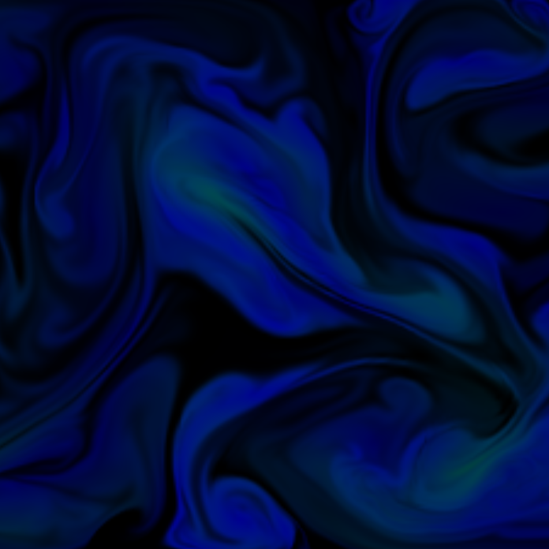
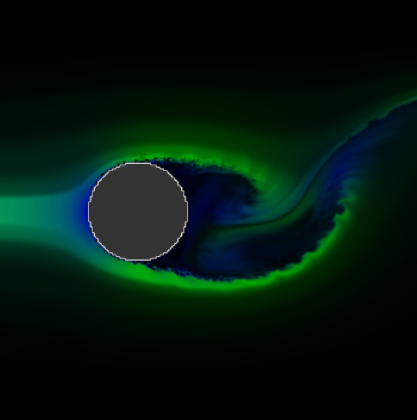
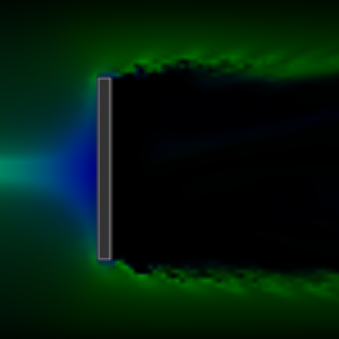

# Eulerian Fluid Simulation

This project implements a 2D grid-based (Eulerian) fluid simulation. It computes incompressible fluid dynamics and supports environmental interaction through customizable boundaries, internal solid obstacles, and continuous inflow sources.

  
  
  

## Built With

* **Core & Graphics**: C++, OpenGL 4.3, GLSL 4.30
* **Libraries**: GLFW, GLAD, GLM

## Simulation Method

The fluid solver operates on a Cartesian grid using a Eulerian framework, meaning it tracks fluid properties at fixed points in space over time rather than following individual particles.

* The implementation uses a Marker-and-Cell (MAC) grid structure.
* Scalar quantities, such as pressure, dye concentration, and solid state flags, are evaluated and stored at the center of each grid cell.
* Velocity components are staggered to ensure stability. Horizontal velocities are stored on the left and right vertical edges of the cells, while vertical velocities are stored on the top and bottom horizontal edges.

## Mathematical Model

The simulation is based on the incompressible Euler equations, focusing on the advection and pressure projection steps. No viscosity or diffusion term is modeled, so the fluid is treated as effectively inviscid.

* **Incompressibility**: The fluid is assumed to have constant density, requiring the velocity field $\mathbf{u}$ to be divergence-free:

$$\nabla \cdot \mathbf{u} = 0$$

* **Momentum**: The change in velocity over time is driven by self-advection and pressure gradients:

$$\frac{\partial \mathbf{u}}{\partial t} = -(\mathbf{u} \cdot \nabla)\mathbf{u} - \frac{1}{\rho}\nabla p$$

## Simulation Steps

The simulation evolves over time by sequentially updating the velocity and dye fields through the following core steps:

* **Pressure Solving**: To enforce the incompressibility constraint ($\nabla \cdot \mathbf{u} = 0$), the solver calculates the pressure required to correct any divergence in the velocity field. This is achieved using an iterative relaxation method across the grid cells. The solver utilizes an over-relaxation factor of **1.7** to accelerate convergence.
* **Velocity Correction**: Once the pressure field has converged, its gradient is subtracted from the current velocity field. This step produces a divergence-free velocity field, which is then carried into the advection steps below.
* **Dye Advection (MacCormack Method)**: A passive scalar field (dye) is transported through the corrected velocity field to visualize the flow. To minimize numerical diffusion (blurring), the simulation employs the MacCormack method.
  * The dye is first advected forward in time, then backward in time to calculate an error estimate.
  * A correction step is applied to the forward-advected field using this estimate.
  * To prevent numerical overshooting during correction, the final dye value is clamped to the minimum and maximum values of the surrounding 2x2 cell stencil.
  * The dye can also be configured to exponentially decay over time.
* **Velocity Advection**: The corrected velocity field advects itself using a semi-Lagrangian approach. To find the new velocity at a given edge, the simulation traces backward in time using a midpoint approximation to find the previous position of the fluid parcel. The velocity at this past position is sampled using bilinear interpolation.

## Boundaries and Obstacles

The environment restricts fluid flow by marking specific cells as solid boundaries. The solver handles these boundaries by forcing the normal velocity components at the solid interfaces to zero.

* **Wind Tunnel**: The simulation can operate in a wind-tunnel mode. This configuration features a continuous inflow jet of fluid on the left boundary and solid top and bottom walls. The right boundary can be dynamically toggled as an open exit or a closed solid wall.
* **Obstacles**: Internal solid geometry can be placed within the flow to disrupt the fluid. The solver supports circular and vertical line obstacles of varying radii, heights, and thicknesses.
* **Sources**: Velocity can be added directly into the grid using radial splatting, with a linear falloff from the center of the source. Dye is emitted similarly within a radius, but is set to a flat strength value across the whole affected area rather than falling off with distance.

## Controls

The application supports real-time interaction through the following mouse and keyboard inputs:

* **Left Mouse Button + Drag**: Injects velocity and emits dye into the fluid based on the cursor's movement direction and position.
* **O Key**: Toggles the solid obstacle on and off.
* **L Key**: Toggles the obstacle type between a circular shape and a vertical line.
* **T Key**: Toggles the wind tunnel boundaries on and off.
* **E Key**: Toggles the wind tunnel's right boundary exit open and closed.

## References

* Sebastian Lague - [Coding Adventure: Simulating Smoke](https://www.youtube.com/watch?v=Q78wvrQ9xsU)
* Ten Minute Physics - [How to write a Eulerian Fluid Simulation](https://matthias-research.github.io/pages/tenMinutePhysics/17-fluidSim.pdf)
* Quang Duong - [Eulerian Fluid Simulation (Part 1)](https://quangduong.me/notes/eulerian_fluid_sim_p1/)
* Medium - [Building a 2D Eulerian Fluid Simulation in C++ and OpenGL](https://medium.com/@mistix11/building-a-2d-eulerian-fluid-simulation-in-c-and-opengl-dc646c8692be)